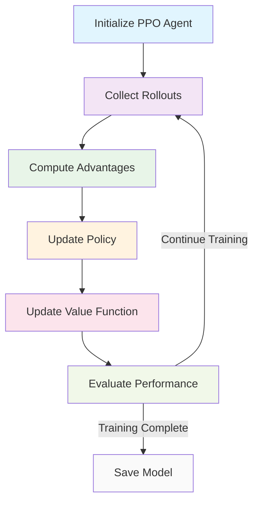

# PPO Agent Implementation Summary

## Overview

This document provides a comprehensive summary of the PPO (Proximal Policy Optimization) agent implementation plan for the trading system. The PPO agent is designed to work with the custom trading environment and leverage the Stable-Baselines3 framework for reinforcement learning-based trading.

## Key Components

### 1. Architecture Design

- **Feature Extractor**: MLPFeaturesExtractor to process 514-dimensional observations
- **Policy Network**: MLPPolicy with separate policy and value networks
- **PPO Agent**: High-level interface integrating all components
- **Training Pipeline**: Complete training, evaluation, and deployment workflow

### 2. Trading Environment Integration

- **Observation Space**: 514-dimensional vector including feature window, predictions, position, and cash/equity ratio
- **Action Space**: Single continuous action representing target net exposure [-1, 1]
- **Reward Function**: Position-based return minus transaction costs
- **Deterministic Processing**: Fixed seeds for reproducible results

### 3. Financial Domain Adaptation

- **Hyperparameters**: Tuned for financial time series (learning_rate=3e-4, gamma=0.99, etc.)
- **Risk Awareness**: Transaction cost modeling integrated into reward function
- **Stability**: Clipped surrogate objective prevents large policy updates
- **Evaluation**: Comprehensive financial metrics (Sharpe ratio, drawdown, etc.)

## Implementation Structure

### Module Organization

```
src/rl/
├── __init__.py
├── ppo/
│   ├── __init__.py
│   ├── ppo_agent.py
│   ├── ppo_policy.py
│   └── ppo_features.py
├── sac/
│   ├── __init__.py
│   ├── sac_agent.py
│   ├── sac_model.py
│   └── sac_features.py
├── training/
│   ├── __init__.py
│   ├── trainer.py
│   ├── callbacks.py
│   └── evaluation.py
├── hyperparameter/
│   ├── __init__.py
│   ├── optimization.py
│   └── search_spaces.py
└── utils/
    ├── __init__.py
    ├── checkpointing.py
    ├── monitoring.py
    └── visualization.py
```

### Configuration

- `configs/ppo_config.json`: PPO hyperparameters
- `docs/agents/ppo_configuration.md`: Detailed configuration documentation

### Documentation

- `docs/agents/ppo_agent_detailed_plan.md`: Complete implementation plan
- `docs/agents/ppo_agent_makefile_tasks.md`: Build and deployment tasks
- `docs/agents/ppo_agent_dag.md`: Implementation dependency graph
- `docs/agents/ppo_agent_acceptance_tests.md`: Validation criteria
- `docs/agents/ppo_agent_rollback_plan.md`: Recovery procedures

## Training Pipeline

### Hyperparameters

```yaml
ppo:
  algorithm: "PPO"
  learning_rate: 3e-4
  n_steps: 2048
  batch_size: 64
  n_epochs: 10
  gamma: 0.99
  gae_lambda: 0.95
  clip_range: 0.2
  ent_coef: 0.0
  vf_coef: 0.5
  max_grad_norm: 0.5
  seed: 42
```

### Process Flow



## Evaluation and Validation

### Acceptance Tests

1. **Deterministic Training**: Verify identical results with fixed seeds
2. **Environment Integration**: Confirm proper interaction with trading environment
3. **Financial Hyperparameters**: Validate appropriate parameter values
4. **Performance Metrics**: Ensure positive risk-adjusted returns
5. **Save/Load Functionality**: Verify model persistence

### Financial Metrics

- Sharpe Ratio: > 0.5
- Maximum Drawdown: < 20%
- Win Rate: > 50%
- Profit Factor: > 1.1
- Calmar Ratio: > 1.0

## Dependencies

### External Libraries

- stable-baselines3>=2.0.0
- torch>=2.0.0
- gymnasium>=0.29.0
- numpy>=1.24.0

### Internal Components

- src/envs/trading_env.py
- src/sl/models/base.py
- src/data/loaders.py

## Implementation Timeline

### Estimated Effort: 3 hours

### Phases

1. **Core Implementation** (1 hour): Architecture and basic components
2. **Training Pipeline** (1 hour): Training loop and evaluation
3. **Integration & Testing** (1 hour): Environment integration and validation

## Risk Management

### Implementation Risks

- Overfitting to training data
- Non-deterministic behavior
- Poor financial performance
- Integration issues

### Mitigation Strategies

- Regular validation on out-of-sample data
- Fixed seeds for deterministic processing
- Comprehensive evaluation metrics
- Thorough testing with environment verification

## Success Criteria

### Technical Requirements

- ✅ PPO agent trains successfully with deterministic results
- ✅ Agent integrates correctly with trading environment
- ✅ Training hyperparameters are appropriate for financial domain
- ✅ Performance meets financial objectives

### Quality Metrics

- Training stability: No gradient explosions
- Deterministic behavior: 100% reproducibility
- Interface compliance: Full Gymnasium compatibility
- Resource usage: Within system constraints

## Next Steps

### Immediate Actions

1. Create RL module structure
2. Implement MLP features extractor
3. Implement MLP policy
4. Implement PPO agent interface

### Follow-up Tasks

1. Develop training pipeline
2. Create evaluation framework
3. Implement acceptance tests
4. Conduct integration testing

## Conclusion

The PPO agent implementation plan provides a comprehensive roadmap for developing a robust reinforcement learning agent for financial trading. By following the detailed architecture, implementation steps, and validation procedures outlined in this plan, the team can successfully deliver a high-quality PPO agent that meets all technical and financial requirements.
