# SAC Agent Implementation DAG

## Overview

This document outlines the implementation dependency graph for the SAC (Soft Actor-Critic) agent, showing task execution order, critical path identification, and parallelization opportunities.

## Implementation Dependency Graph

## Task Dependencies and Execution Order

### Phase 1: Foundation (Hours 1-4)

#### Task A: Project Setup

- **Duration**: 0.5 hours
- **Dependencies**: None
- **Description**: Initialize project environment and verify dependencies
- **Critical Path**: Yes

#### Task B: Directory Structure

- **Duration**: 0.5 hours
- **Dependencies**: Task A
- **Description**: Create directory structure and package files
- **Critical Path**: Yes

#### Task C: SACFeatureExtractor

- **Duration**: 1.5 hours
- **Dependencies**: Task B
- **Description**: Implement feature extractor for trading environment observations
- **Critical Path**: Yes

#### Task D: SACAgent Class

- **Duration**: 1.5 hours
- **Dependencies**: Task B
- **Description**: Implement basic SAC agent class structure
- **Critical Path**: Yes

### Phase 2: Core Implementation (Hours 5-10)

#### Task E: Core Implementation

- **Duration**: 2 hours
- **Dependencies**: Tasks C, D
- **Description**: Integrate SACFeatureExtractor with SACAgent
- **Critical Path**: Yes

#### Task F: Configuration Management

- **Duration**: 1 hour
- **Dependencies**: Task E
- **Description**: Implement configuration loading and management
- **Critical Path**: Yes

#### Task G: Model Persistence

- **Duration**: 1 hour
- **Dependencies**: Task E
- **Description**: Implement save/load functionality for models
- **Critical Path**: Yes

### Phase 3: Testing and Validation (Hours 11-15)

#### Task H: Unit Testing

- **Duration**: 1.5 hours
- **Dependencies**: Tasks F, G
- **Description**: Create and execute unit tests for core components
- **Critical Path**: Yes

#### Task I: Integration Testing

- **Duration**: 1 hour
- **Dependencies**: Task H
- **Description**: Test integration with trading environment
- **Critical Path**: Yes

#### Task J: Acceptance Testing

- **Duration**: 1 hour
- **Dependencies**: Task H
- **Description**: Execute acceptance tests for validation
- **Critical Path**: Yes

#### Task K: Test Validation

- **Duration**: 0.5 hours
- **Dependencies**: Tasks I, J
- **Description**: Validate test results and fix issues
- **Critical Path**: Yes

### Phase 4: Documentation and Scripts (Hours 16-18)

#### Task L: Documentation

- **Duration**: 1 hour
- **Dependencies**: Task K
- **Description**: Complete all documentation files
- **Critical Path**: No

#### Task M: Script Implementation

- **Duration**: 1 hour
- **Dependencies**: Task K
- **Description**: Create training and evaluation scripts
- **Critical Path**: No

#### Task N: Final Review

- **Duration**: 0.5 hours
- **Dependencies**: Tasks L, M
- **Description**: Final review and quality check
- **Critical Path**: No

## Critical Path Analysis

### Main Critical Path (15 hours)

A → B → C → E → F → H → I → K → L → N

### Parallelizable Tasks

- **Documentation** (Task L): Can run in parallel with script implementation
- **Script Implementation** (Task M): Can run in parallel with documentation

### Slack Time

- Tasks L and M have 3 hours of slack time
- These tasks can be delayed without affecting project completion

## Resource Allocation

### Development Resources

- **Primary Developer**: 1 person (full time)
- **Code Reviewer**: 1 person (part time)
- **Tester**: 1 person (part time)

### Parallel Execution Opportunities

1. **Documentation and Script Development**: Tasks L and M can be executed in parallel
2. **Testing**: Unit, integration, and acceptance tests can be developed in parallel
3. **Review**: Code review can happen in parallel with development

## Milestone Tracking

### Milestone 1: Foundation Complete (4 hours)

- Tasks A, B, C, D completed
- Directory structure in place
- Basic components implemented

### Milestone 2: Core Implementation Complete (10 hours)

- Tasks E, F, G completed
- Core functionality working
- Configuration and persistence implemented

### Milestone 3: Testing Complete (15 hours)

- Tasks H, I, J, K completed
- All tests passing
- Implementation validated

### Milestone 4: Project Complete (18 hours)

- All tasks completed
- Documentation finished
- Ready for deployment

## Risk Analysis

### High-Risk Tasks

1. **SACAgent Integration** (Task E): Complex integration with Stable-baselines3
2. **Integration Testing** (Task I): Environment compatibility challenges
3. **Acceptance Testing** (Task J): Performance requirements may be difficult to meet

### Mitigation Strategies

1. **Early Prototyping**: Start integration tasks early with simple prototypes
2. **Frequent Testing**: Test integration regularly during development
3. **Performance Monitoring**: Monitor performance metrics throughout development

## Dependencies Summary

### Technical Dependencies

- Stable-baselines3 library
- Trading environment implementation
- PyTorch framework
- Gymnasium interface

### Documentation Dependencies

- PPO agent documentation for reference
- Trading environment documentation
- System architecture documentation

### Test Dependencies

- Test data files
- Testing framework (pytest)
- Performance benchmarking tools

## Timeline Visualization

```mermaid
gantt
    title SAC Agent Implementation Timeline
    dateFormat  HH:mm
    section Foundation
    Project Setup          :a1, 00:00, 0.5h
    Directory Structure    :a2, after a1, 0.5h
    SACFeatureExtractor    :a3, after a2, 1.5h
    SACAgent Class         :a4, after a2, 1.5h
    section Core Implementation
    Core Integration       :a5, after a3, 2h
    Configuration          :a6, after a5, 1h
    Model Persistence      :a7, after a5, 1h
    section Testing
    Unit Testing           :a8, after a6, 1.5h
    Integration Testing    :a9, after a8, 1h
    Acceptance Testing     :a10, after a8, 1h
    Test Validation        :a11, after a9, 0.5h
    section Documentation
    Documentation          :a12, after a11, 1h
    Script Implementation  :a13, after a11, 1h
    Final Review           :a14, after a12, 0.5h
```

## Quality Gates

### Gate 1: Foundation Review

- Directory structure verified
- Basic components compile without errors
- Package imports working

### Gate 2: Core Implementation Review

- SACAgent integrates with Stable-baselines3
- Configuration management functional
- Model persistence working

### Gate 3: Testing Review

- Unit tests passing (>80% coverage)
- Integration tests successful
- Acceptance criteria met

### Gate 4: Final Review

- Documentation complete and accurate
- All scripts functional
- Code quality standards met

## Monitoring and Control

### Progress Tracking

- Daily standups to track task completion
- Weekly milestone reviews
- Continuous integration for automated testing

### Issue Management

- Log issues in project tracking system
- Prioritize based on critical path impact
- Escalate blocking issues immediately

### Change Control

- Document all changes to implementation plan
- Assess impact on timeline and resources
- Update dependencies and critical path as needed

## Conclusion

The SAC agent implementation follows a structured approach with clear dependencies and parallelization opportunities. The critical path of 15 hours provides a realistic timeline for core functionality, while the additional 3 hours allow for documentation and script development. Regular milestone reviews and quality gates ensure the implementation stays on track and meets all requirements.
