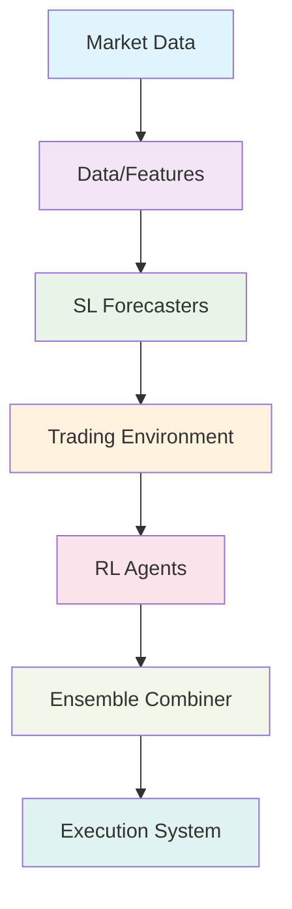

# Trading System Architecture Summary

This document provides a comprehensive summary of the complete trading system architecture, integrating all components into a cohesive framework for algorithmic trading using reinforcement learning.

## System Overview

The trading system follows a modular architecture that processes market data through multiple stages to generate executable trading signals. The system is designed with clear separation of concerns, enabling independent development and testing of each component.

## Component Pipeline

### 1. Market Data Collection

- **Purpose**: Gather raw market data from multiple sources
- **Key Features**:
  - Multi-source data integration (Yahoo Finance, Alpaca, custom APIs)
  - Data quality validation and cleaning
  - Storage in efficient formats (Parquet, PostgreSQL)
- **Output**: Clean, synchronized market data

### 2. Feature Engineering

- **Purpose**: Transform raw data into predictive features
- **Key Features**:
  - Technical indicator calculation
  - Cross-sectional feature generation
  - Normalization and scaling
  - Dimensionality reduction
- **Output**: Engineered feature set for modeling

### 3. Supervised Learning Forecasters

- **Purpose**: Generate predictions for expected returns, volatility, and distributions
- **Key Features**:
  - Multiple model types (traditional, tree-based, deep learning)
  - Data leakage prevention
  - Uncertainty quantification
  - Ensemble methods
- **Output**: Predictive signals for the trading environment

### 4. Trading Environment

- **Purpose**: Provide RL training environment with realistic market dynamics
- **Key Features**:
  - Gymnasium-compliant interface
  - Comprehensive reward function
  - Transaction cost modeling
  - Risk management integration
- **Output**: Environment for RL agent training

### 5. Reinforcement Learning Agents

- **Purpose**: Learn optimal trading policies through interaction with the environment
- **Key Features**:
  - PPO implementation with Stable-Baselines3
  - SAC implementation with Ray RLlib
  - CNN+LSTM feature extraction
  - Distributed training capabilities
- **Output**: Trained trading agents

### 6. Ensemble Combiner

- **Purpose**: Combine RL agent signals with risk management
- **Key Features**:
  - Weighted signal combination
  - Dynamic weight adjustment
  - Position caps and governors
  - Signal validation
- **Output**: Risk-adjusted trading signals

### 7. Execution and Evaluation

- **Purpose**: Execute trades and evaluate performance
- **Key Features**:
  - Multiple execution algorithms
  - Backtesting infrastructure
  - Live trading integration
  - Comprehensive reporting
- **Output**: Executed trades and performance reports

## Data Flow Architecture

```mermaid
graph LR
    A[Raw Data] --> B[Cleaned Data]
    B --> C[Features]
    C --> D[Predictions]
    D --> E[Observations]
    E --> F[Actions]
    F --> G[Ensemble Signal]
    G --> H[Orders]
    H --> I[Executed Trades]

    style A fill:#e1f5fe
    style B fill:#f3e5f5
    style C fill:#e8f5e8
    style D fill:#fff3e0
    style E fill:#fce4ec
    style F fill:#f1f8e9
    style G fill:#e0f2f1
    style H fill:#d7ccc8
    style I fill:#fafafa
```

## Key Design Principles

### 1. Modularity

Each component is designed as an independent module with well-defined interfaces, enabling:

- Independent development and testing
- Easy replacement of individual components
- Parallel development by multiple teams

### 2. Data Integrity

Special attention is paid to prevent data leakage:

- Temporal alignment in feature engineering
- Proper train/validation/test splits
- Forward-looking bias prevention
- Survivorship bias handling

### 3. Risk Management

Built-in risk controls at multiple levels:

- Position limits in ensemble combiner
- Volatility-based position scaling
- Drawdown protection mechanisms
- Portfolio-level constraints

### 4. Performance Optimization

The system is designed for efficiency:

- Vectorized operations where possible
- Parallel processing for training
- GPU acceleration for deep learning
- Efficient data storage and retrieval

## Technology Stack

### Core Libraries

- **Reinforcement Learning**: Stable-Baselines3, Ray RLlib
- **Data Processing**: NumPy, Pandas, Scikit-learn
- **Deep Learning**: PyTorch
- **Market Data**: yfinance, Alpaca-py
- **Environment**: Gymnasium

### Infrastructure

- **Distributed Computing**: Ray for parallel training
- **Data Storage**: PostgreSQL, Parquet files
- **Visualization**: Plotly, Matplotlib
- **Documentation**: Sphinx, Markdown

## Deployment Architecture

### Development Environment

- Local development with Docker containers
- Jupyter notebooks for experimentation
- Unit testing with pytest
- Code quality checks with pre-commit hooks

### Production Environment

- Cloud deployment (AWS/GCP/Azure)
- Kubernetes for container orchestration
- CI/CD pipeline for automated deployment
- Monitoring and alerting systems

## Performance Monitoring

### Real-time Metrics

- Portfolio performance tracking
- Risk metric monitoring
- Execution quality assessment
- System health checks

### Historical Analysis

- Backtesting result evaluation
- Strategy performance attribution
- Risk-adjusted return analysis
- Benchmark comparison

## Future Extensions

### Additional Components

- Alternative data integration
- Advanced execution algorithms
- Multi-agent collaboration
- Meta-learning for strategy adaptation

### Enhanced Features

- Real-time feature importance analysis
- Automated hyperparameter optimization
- Dynamic ensemble weighting
- Regime-aware strategy selection

## Conclusion

This architecture provides a robust foundation for developing and deploying algorithmic trading strategies using reinforcement learning. The modular design enables flexibility and scalability while maintaining rigorous standards for data integrity and risk management. The system is designed to evolve with changing market conditions and technological advances.
