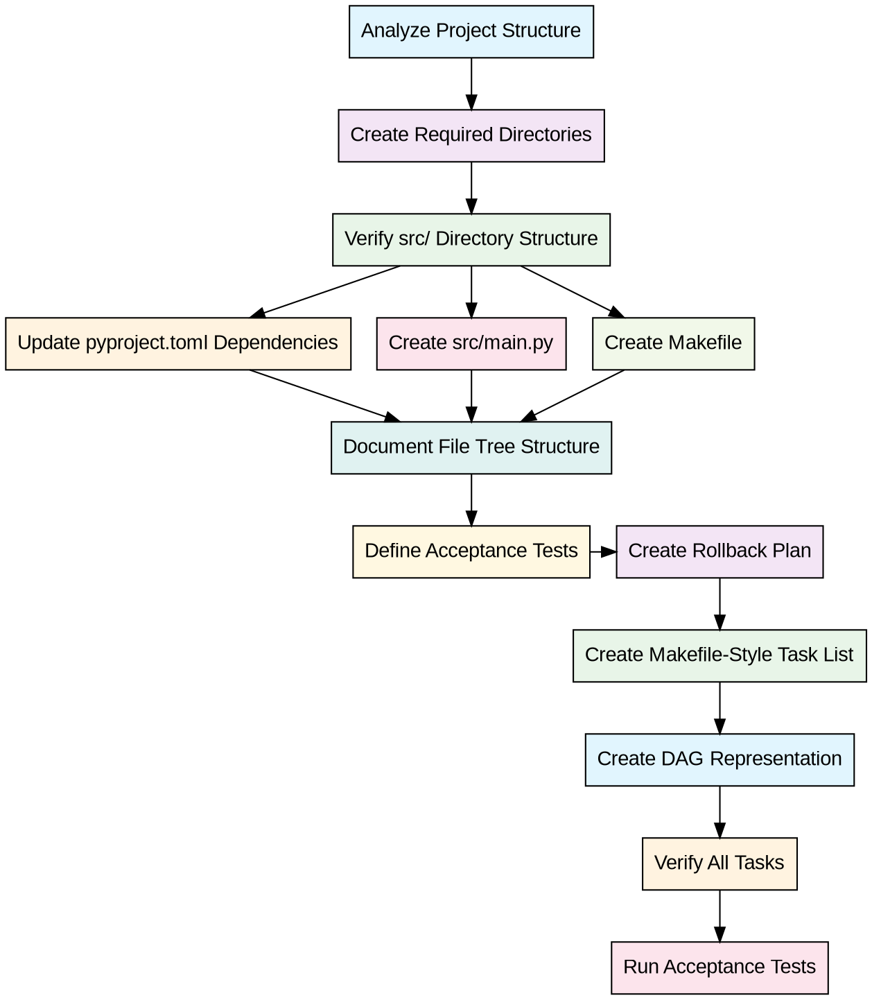

# DAG Representation for trade-agent Initialization

## Overview

This document provides a Directed Acyclic Graph (DAG) representation of the tasks for Step 1: Project skeleton & dependencies (Chunk0).

## DAG Visualization

### Mermaid Diagram

```{mermaid}
graph TD
    A[Analyze Project Structure] --> B[Create Required Directories]
    B --> C[Verify src/ Directory Structure]
    C --> D[Update pyproject.toml Dependencies]
    C --> E[Create src/main.py]
    C --> F[Create Makefile]
    D --> G[Document File Tree Structure]
    E --> G
    F --> G
    G --> H[Define Acceptance Tests]
    H --> I[Create Rollback Plan]
    I --> J[Create Makefile-Style Task List]
    J --> K[Create DAG Representation]
    K --> L[Verify All Tasks]
    L --> M[Run Acceptance Tests]

    style A fill:#e1f5fe
    style B fill:#f3e5f5
    style C fill:#e8f5e8
    style D fill:#fff3e0
    style E fill:#fce4ec
    style F fill:#f1f8e9
    style G fill:#e0f2f1
    style H fill:#fff8e1
    style I fill:#f3e5f5
    style J fill:#e8f5e8
    style K fill:#e1f5fe
    style L fill:#fff3e0
    style M fill:#fce4ec
```

### Graphviz Representation



## Task Dependencies Analysis

### Critical Path

The critical path (longest sequence of dependent tasks) is:

```
Analyze → Create Dirs → Verify src → Update Deps → Document → Define Tests →
Create Rollback → Create Task List → Create DAG → Verify → Acceptance Tests
```

### Parallelizable Tasks

After "Verify src/ Directory Structure", the following tasks can be executed in parallel:

- Update pyproject.toml Dependencies
- Create src/main.py
- Create Makefile

### Task Levels

1. **Level 1**: Analyze Project Structure
2. **Level 2**: Create Required Directories
3. **Level 3**: Verify src/ Directory Structure
4. **Level 4**: (Parallel) Update Dependencies, Create main.py, Create Makefile
5. **Level 5**: Document File Tree Structure
6. **Level 6**: Define Acceptance Tests
7. **Level 7**: Create Rollback Plan
8. **Level 8**: Create Makefile-Style Task List
9. **Level 9**: Create DAG Representation
10. **Level 10**: Verify All Tasks
11. **Level 11**: Run Acceptance Tests

## Resource Requirements

### Human Resources

- **Architect/Planner**: Levels 1-11 (full involvement)
- **Developer**: Levels 4-5 (parallel implementation)
- **QA Engineer**: Levels 6, 11 (testing focus)

### Technical Resources

- **Development Environment**: Required for all tasks
- **Version Control**: Required for Levels 1, 2, 4, 5, 8, 9, 10
- **Documentation Tools**: Required for Levels 4, 5, 6, 7, 8, 9, 11

## Timeline Estimation

### Task Duration Estimates

1. Analyze Project Structure: 30 minutes
2. Create Required Directories: 15 minutes
3. Verify src/ Directory Structure: 15 minutes
4. Update pyproject.toml Dependencies: 45 minutes
5. Create src/main.py: 60 minutes
6. Create Makefile: 45 minutes
7. Document File Tree Structure: 30 minutes
8. Define Acceptance Tests: 60 minutes
9. Create Rollback Plan: 45 minutes
10. Create Makefile-Style Task List: 45 minutes
11. Create DAG Representation: 30 minutes
12. Verify All Tasks: 15 minutes
13. Run Acceptance Tests: 30 minutes

### Critical Path Duration

Total: ~8 hours (sequential execution)

### Parallel Execution Duration

With parallelization of Levels 4 tasks: ~6 hours

## Risk Analysis

### High-Risk Dependencies

- **Verify src/ Directory Structure** → All subsequent tasks depend on correct structure
- **Update pyproject.toml Dependencies** → Affects all dependency-related tasks

### Mitigation Strategies

1. **Early Verification**: Verify directory structure immediately after creation
2. **Incremental Commits**: Commit each task completion to version control
3. **Backup Points**: Create backups before major dependency changes

## Monitoring and Control

### Progress Indicators

- **Completion Percentage**: Track completed tasks vs. total tasks
- **Dependency Resolution**: Monitor successful dependency installation
- **Test Pass Rate**: Track acceptance test results

### Milestone Checkpoints

1. **Milestone 1**: Directory structure verified (Task 3)
2. **Milestone 2**: Core files planned (Tasks 4, 5, 6)
3. **Milestone 3**: Documentation complete (Tasks 7, 8, 9)
4. **Milestone 4**: Planning complete (Tasks 10, 11)
5. **Milestone 5**: Verification and testing (Tasks 12, 13)

## Rollback Points

### Safe Rollback States

1. **After Task 1**: Initial analysis complete
2. **After Task 3**: Directory structure verified
3. **After Task 6**: Core files planned
4. **After Task 9**: Documentation complete

### Recovery Procedures

Each rollback point has associated recovery procedures documented in `docs/rollback_plan.md`.

## Quality Gates

### Entry Criteria

- Previous task successfully completed
- Required artifacts produced
- Dependencies satisfied

### Exit Criteria

- Task deliverables completed
- Quality checks passed
- Documentation updated

### Approval Gates

- **Gate 1**: Architecture review after Task 3
- **Gate 2**: Design review after Task 6
- **Gate 3**: Documentation review after Task 9
- **Gate 4**: Final review before acceptance tests

## Communication Plan

### Status Reporting

- Daily progress updates
- Weekly milestone reports
- Immediate escalation for blockers

### Stakeholder Updates

- **Development Team**: Daily standups
- **Project Manager**: Weekly status reports
- **Quality Assurance**: Testing coordination
- **Documentation Team**: Review coordination

This DAG representation provides a comprehensive view of the task dependencies, execution order, and project flow for the trade-agent initialization step.
