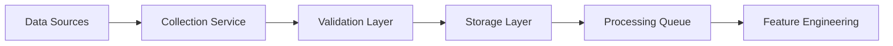

# Market Data Component

The Market Data component is responsible for collecting, storing, and preprocessing raw market data from various sources. This component serves as the foundation of the entire trading system, providing the raw materials needed for feature engineering and model training.

## Overview

The Market Data component handles:

1. Data collection from various sources (Yahoo Finance, Alpaca, custom APIs)
2. Data storage and retrieval
3. Initial data cleaning and validation
4. Data synchronization across different sources
5. Data quality monitoring

## Data Sources

### Yahoo Finance

- Primary source for historical OHLCV data
- Used for backtesting and model training
- Accessible through the `yfinance` library

### Alpaca

- Real-time market data feed
- Live trading execution
- Accessible through the `alpaca-py` library

### Custom Data Sources

- Support for proprietary data feeds
- Integration with alternative data providers
- Custom API connectors

## Data Types

### OHLCV Data

- Open, High, Low, Close prices
- Volume information
- Timestamp information
- Asset identifiers

### Tick Data

- Individual trade records
- Bid/ask quotes
- Market depth information
- High-frequency data streams

### Alternative Data

- News sentiment data
- Economic indicators
- Social media sentiment
- Satellite imagery data

## Data Storage

### File-based Storage

- CSV files for simple storage
- Parquet files for efficient compression
- HDF5 for large datasets

### Database Storage

- PostgreSQL for relational data
- TimescaleDB for time-series data
- Redis for caching frequently accessed data

## Data Pipeline



## Data Quality Assurance

### Validation Checks

- Missing data detection
- Outlier detection
- Data consistency verification
- Currency and unit validation

### Data Cleaning

- Handling missing values
- Removing outliers
- Adjusting for stock splits and dividends
- Currency conversion

## Module Structure

```
src/data/
├── __init__.py
├── collectors/
│   ├── __init__.py
│   ├── yahoo_finance.py
│   ├── alpaca.py
│   └── custom_sources/
├── storage/
│   ├── __init__.py
│   ├── file_storage.py
│   ├── database.py
│   └── cache.py
├── validators/
│   ├── __init__.py
│   ├── data_quality.py
│   └── consistency.py
└── pipelines/
    ├── __init__.py
    └── data_pipeline.py
```

## Interfaces

### Collector Interface

```python
class DataCollector:
    def fetch_data(self, symbols, start_date, end_date):
        """Fetch data for given symbols and date range"""
        pass

    def stream_data(self, symbols):
        """Stream real-time data for given symbols"""
        pass
```

### Storage Interface

```python
class DataStorage:
    def save(self, data, identifier):
        """Save data with given identifier"""
        pass

    def load(self, identifier):
        """Load data by identifier"""
        pass

    def query(self, criteria):
        """Query data by criteria"""
        pass
```

## Configuration

The Market Data component can be configured through environment variables or configuration files:

```yaml
data:
  sources:
    - name: "yahoo_finance"
      enabled: true
      priority: 1
    - name: "alpaca"
      enabled: true
      priority: 2
      api_key: ${ALPACA_API_KEY}
      secret_key: ${ALPACA_SECRET_KEY}

  storage:
    type: "postgresql"
    connection_string: ${DATABASE_URL}

  validation:
    check_missing_data: true
    outlier_threshold: 3.0
```

## Performance Considerations

- Parallel data fetching for multiple symbols
- Efficient data serialization formats
- Caching of frequently accessed data
- Batch processing for large datasets
