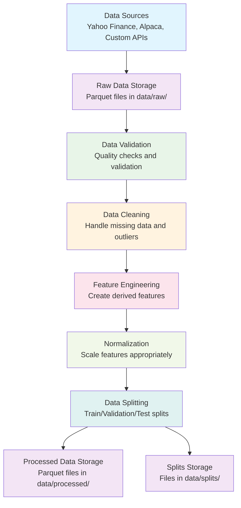

# Data Pipeline DAG Representation

## Visual Flow Diagram

## Node Descriptions

### A. Data Sources

- **Inputs**: API connections to data providers
- **Outputs**: Raw financial data
- **Technologies**: yfinance, alpaca-py, custom connectors

### B. Raw Data Storage

- **Inputs**: Raw financial data from sources
- **Outputs**: Stored Parquet files
- **Location**: `data/raw/` directory
- **Format**: Parquet for efficiency

### C. Data Validation

- **Inputs**: Raw data from storage
- **Outputs**: Validation report, clean data
- **Processes**:
  - Missing data detection
  - Outlier detection
  - Consistency checks
  - Temporal validation

### D. Data Cleaning

- **Inputs**: Validated data
- **Outputs**: Cleaned data
- **Processes**:
  - Missing data imputation
  - Outlier handling
  - Corporate actions adjustment
  - Data type normalization

### E. Feature Engineering

- **Inputs**: Cleaned data
- **Outputs**: Engineered features
- **Processes**:
  - Technical indicators
  - Lag features
  - Rolling window statistics
  - Custom feature creation

### F. Normalization

- **Inputs**: Engineered features
- **Outputs**: Scaled features
- **Processes**:
  - Min-max scaling
  - Z-score normalization
  - Robust scaling
  - Parameter isolation (training data only)

### G. Data Splitting

- **Inputs**: Normalized features
- **Outputs**: Train/validation/test sets
- **Processes**:
  - Temporal splitting
  - Deterministic with fixed seeds
  - Multi-asset consistency
  - Metadata preservation

### H. Processed Data Storage

- **Inputs**: Processed features
- **Outputs**: Stored Parquet files
- **Location**: `data/processed/` directory
- **Format**: Parquet for modeling efficiency

### I. Splits Storage

- **Inputs**: Train/validation/test splits
- **Outputs**: Stored split files
- **Location**: `data/splits/` directory
- **Format**: Parquet with metadata
