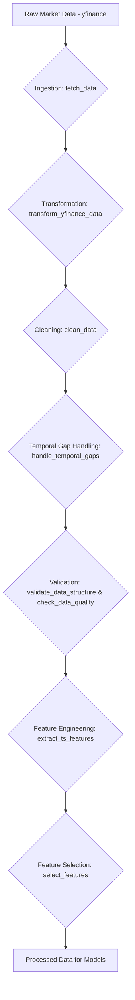

# Data Processing Workflows

This document outlines the design for data processing workflows in the trade-agent system. These workflows handle data cleaning, temporal gap handling, feature engineering, and quality validation for financial time-series data.

## 1. Overview

The automated preprocessing workflows will process raw market data through several stages:

1.  Data Cleaning and Validation
2.  Temporal Gap Handling
3.  Feature Engineering
4.  Data Quality Assurance
5.  Storage in TimescaleDB

## 2. Data Flow

## 3. Temporal Gap Handling

Temporal gaps in the time series data are handled in the `handle_temporal_gaps` function in `src/data/processing.py`. This function resamples the data to a specified frequency and then uses interpolation and forward/backward filling to fill in missing data points.

### Configuration

The following parameters are configurable for temporal gap handling:

| Parameter              | Description                                                           | Default  |
| ---------------------- | --------------------------------------------------------------------- | -------- |
| `interval`             | The frequency to resample to (e.g., '1D' for daily, '1H' for hourly). | '1D'     |
| `interpolation_method` | Method for interpolation (e.g., 'linear', 'polynomial', 'spline').    | 'linear' |
| `ffill_limit`          | Maximum number of consecutive NaN values to forward fill.             | 5        |
| `bfill_limit`          | Maximum number of consecutive NaN values to backward fill.            | 5        |

## 4. Data Quality

Data quality is checked in the `check_data_quality` function in `src/data/processing.py`. This function checks for null values, temporal gaps, and zero values.

### Configuration

| Parameter                  | Description                                             | Default       |
| -------------------------- | ------------------------------------------------------- | ------------- |
| `max_temporal_gap_seconds` | The maximum allowed gap in seconds between data points. | 86400 (1 day) |
| `max_null_percentage`      | The maximum allowed percentage of null values.          | 0.05          |
