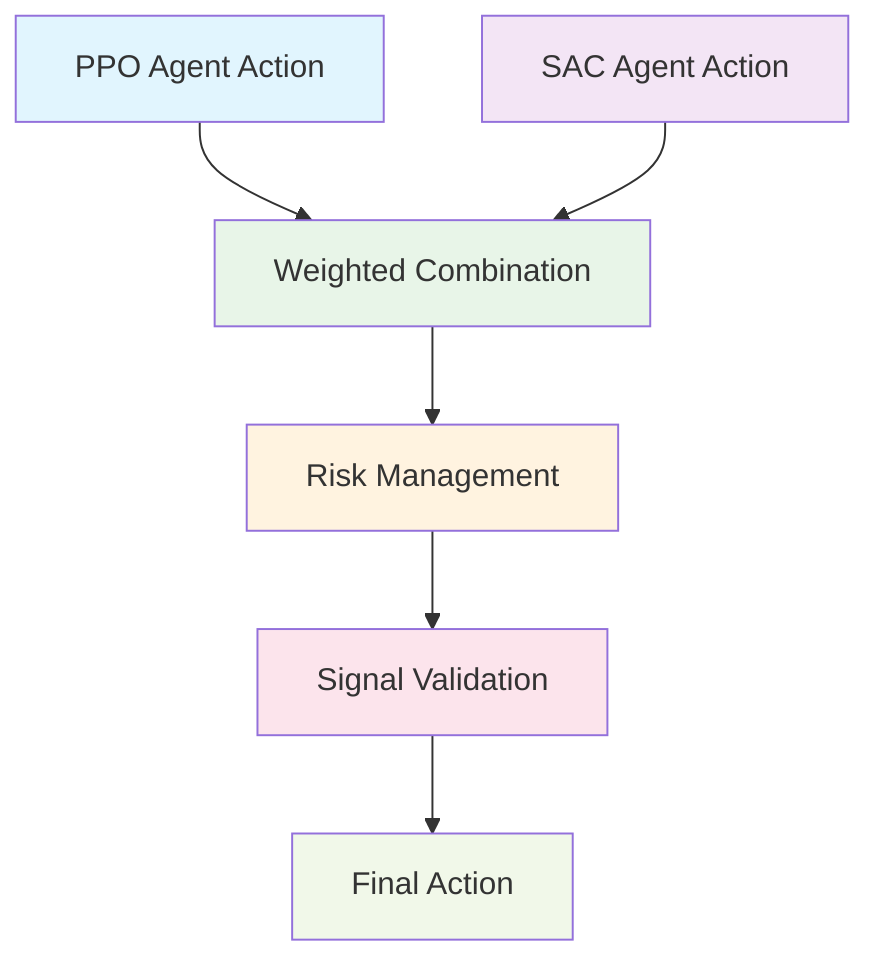

# Ensemble Combiner Component

The Ensemble Combiner component combines predictions from both RL agents (PPO and SAC) using weighted averaging, with additional risk management caps and governors. This component serves as the final decision-making layer that produces actionable trading signals.

## Overview

The Ensemble Combiner component handles:

1. Weighted combination of RL agent predictions
2. Dynamic weight adjustment based on performance
3. Risk management through position caps and governors
4. Signal validation and filtering
5. Execution readiness assessment

## Ensemble Methods

### Weighted Average Combination

The ensemble combines actions from both agents using a weighted average:

```
a = w * a_SAC + (1-w) * a_PPO
```

Where:

- `a` is the final ensemble action
- `w` is the weight for SAC agent (0 ≤ w ≤ 1)
- `a_SAC` is the action from SAC agent
- `a_PPO` is the action from PPO agent

### Weight Determination Methods

#### Fixed Weights

- Static weights determined during training
- Based on historical performance
- Simple and interpretable

#### Dynamic Weights

- Time-varying weights based on recent performance
- Volatility-adjusted weighting
- Regime-dependent weights

#### Performance-based Weights

- Sharpe ratio weighted combination
- Return-based weighting
- Risk-adjusted performance weighting

## Risk Management Integration

### Position Caps

- Individual asset position limits
- Portfolio-level exposure constraints
- Sector/industry concentration limits

### Governors

- Volatility-based position scaling
- Drawdown-based risk reduction
- Market regime adjustment factors

### Signal Validation

- Cross-agent agreement checks
- Confidence threshold filtering
- Extreme position rejection

## Ensemble Pipeline



## Dynamic Weight Adjustment

### Performance-based Weighting

- Rolling window performance calculation
- Sharpe ratio-based weights
- Information ratio weighting

### Volatility-adjusted Weighting

- Risk parity weighting
- Volatility inverse weighting
- Minimum variance weighting

### Regime-based Weighting

- Market regime detection
- Regime-specific weight selection
- Adaptive weight switching

## Risk Caps Implementation

### Individual Position Limits

- Maximum long position per asset
- Maximum short position per asset
- Gross exposure limits

### Portfolio-level Constraints

- Portfolio volatility limits
- Value-at-Risk constraints
- Maximum drawdown limits

### Sector Constraints

- Sector exposure limits
- Industry concentration caps
- Geographic allocation constraints

## Governors and Controls

### Volatility Governors

- Position scaling based on market volatility
- Volatility targeting mechanisms
- Volatility breakout filters

### Drawdown Governors

- Position reduction during drawdowns
- Recovery-based position scaling
- Maximum drawdown stops

### Market Regime Governors

- Bull/bear market adjustments
- Volatility regime adaptation
- Liquidity-based scaling

## Signal Validation

### Cross-Agent Agreement

- Correlation between agent signals
- Disagreement threshold filtering
- Consensus-based signal generation

### Confidence Filtering

- Minimum confidence thresholds
- Uncertainty-based signal rejection
- Prediction interval validation

### Extreme Value Handling

- Outlier detection and treatment
- Tail risk filtering
- Position smoothing

## Module Structure

```
src/ensemble/
├── __init__.py
├── combiner.py
├── weighting/
│   ├── __init__.py
│   ├── fixed_weights.py
│   ├── dynamic_weights.py
│   └── performance_weights.py
├── risk_management/
│   ├── __init__.py
│   ├── position_caps.py
│   ├── governors.py
│   └── constraints.py
├── validation/
│   ├── __init__.py
│   ├── agreement.py
│   ├── confidence.py
│   └── extreme_values.py
└── utils/
    ├── __init__.py
    ├── performance_tracker.py
    └── regime_detector.py
```

## Interfaces

### Ensemble Combiner Interface

```python
class EnsembleCombiner:
    def __init__(self, ppo_agent, sac_agent, config):
        """Initialize ensemble combiner with agents and configuration"""
        pass

    def combine_actions(self, observation):
        """Combine actions from both agents"""
        pass

    def update_weights(self, performance_data):
        """Update ensemble weights based on performance"""
        pass

    def validate_signal(self, action):
        """Validate and adjust final action"""
        pass
```

### Weighting Strategy Interface

```python
class WeightingStrategy:
    def calculate_weights(self, ppo_performance, sac_performance):
        """Calculate weights based on agent performance"""
        pass

    def update(self, new_data):
        """Update strategy with new performance data"""
        pass
```

## Configuration

The Ensemble Combiner can be configured through configuration files:

```yaml
ensemble:
  weighting:
    method: "performance_based"
    performance_window: 252
    update_frequency: "daily"

  risk_management:
    position_limits:
      max_long: 0.1
      max_short: -0.1
      max_gross_exposure: 1.5

    portfolio_constraints:
      max_volatility: 0.2
      max_var: 0.05
      max_drawdown: 0.15

  governors:
    volatility_scaling: true
    drawdown_protection: true
    regime_adjustment: true

  validation:
    min_correlation: 0.5
    confidence_threshold: 0.7
    extreme_value_filter: true
```

## Performance Monitoring

### Ensemble Performance Metrics

- Combined strategy Sharpe ratio
- Portfolio volatility
- Maximum drawdown
- Win rate and profit factor

### Component Performance

- Individual agent contributions
- Weight stability metrics
- Risk adjustment effectiveness

### Risk Metrics

- VaR and CVaR tracking
- Portfolio concentration measures
- Regime transition analysis

## Performance Considerations

- Low-latency signal combination
- Efficient weight calculation algorithms
- Real-time risk metric computation
- Memory-efficient performance tracking
- Parallel processing for multiple assets
