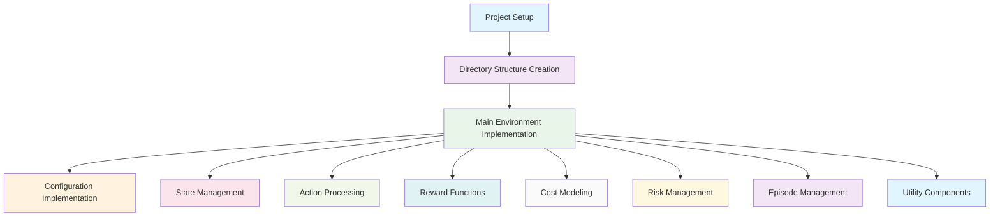
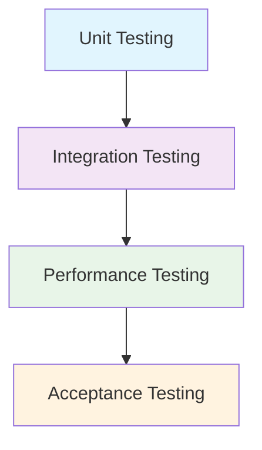
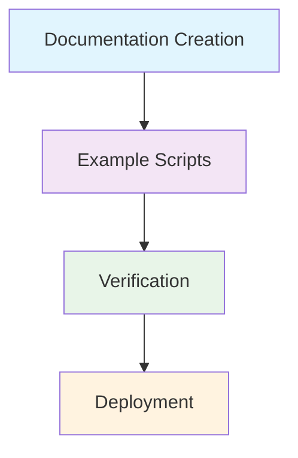
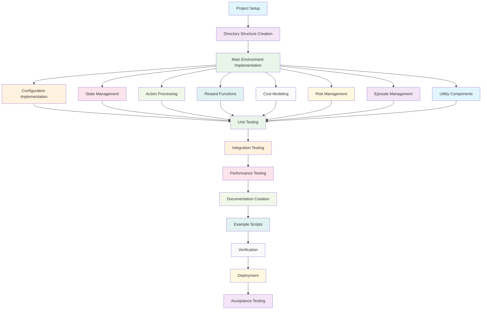
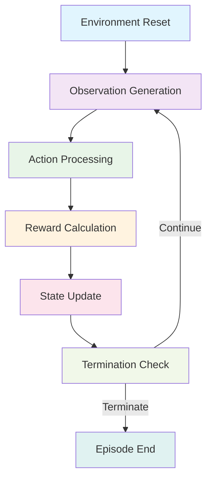
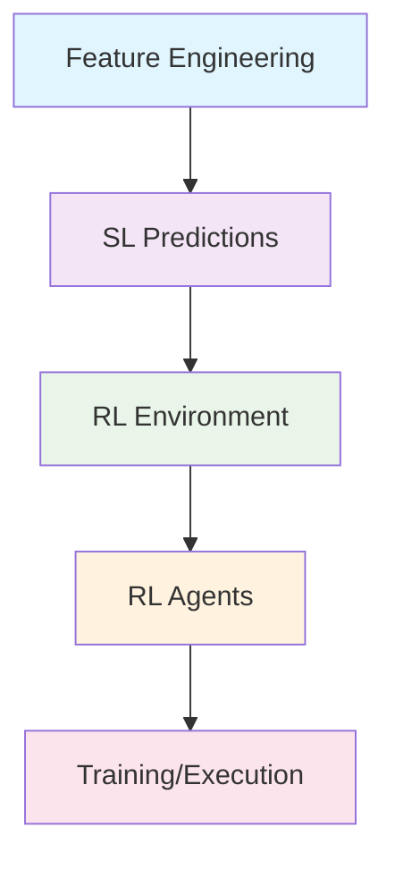

# RL Environment Implementation - DAG Representation

## 1. RL Environment Pipeline Nodes

### 1.1 Core Implementation Nodes



### 1.2 Testing Pipeline Nodes



### 1.3 Documentation and Deployment Nodes



## 2. Complete RL Environment Implementation DAG



## 3. Environment Operation DAG



## 4. Dependencies

### 4.1 Implementation Dependencies

```
[Project Setup] → [Directory Structure Creation] → [Main Environment Implementation] →
[Configuration Implementation, State Management, Action Processing, Reward Functions,
Cost Modeling, Risk Management, Episode Management, Utility Components] →
[Unit Testing] → [Integration Testing] → [Performance Testing] →
[Documentation Creation] → [Example Scripts] → [Verification] → [Deployment] →
[Acceptance Testing]
```

### 4.2 Environment Operation Dependencies

```
[Environment Reset] → [Observation Generation] → [Action Processing] →
[Reward Calculation] → [State Update] → [Termination Check] →
[Observation Generation (if continue) | Episode End (if terminate)]
```

### 4.3 Integration with Overall System



## 5. Task Dependencies Analysis

### 5.1 Critical Path

The critical path (longest sequence of dependent tasks) is:

```
Project Setup → Directory Structure Creation → Main Environment Implementation →
Unit Testing → Integration Testing → Performance Testing →
Documentation Creation → Verification → Deployment → Acceptance Testing
```

### 5.2 Parallelizable Tasks

After "Main Environment Implementation", the following tasks can be executed in parallel:

- Configuration Implementation
- State Management
- Action Processing
- Reward Functions
- Cost Modeling
- Risk Management
- Episode Management
- Utility Components

### 5.3 Task Levels

1. **Level 1**: Project Setup
2. **Level 2**: Directory Structure Creation
3. **Level 3**: Main Environment Implementation
4. **Level 4**: (Parallel) Component Implementations
5. **Level 5**: Unit Testing
6. **Level 6**: Integration Testing
7. **Level 7**: Performance Testing
8. **Level 8**: Documentation Creation
9. **Level 9**: Example Scripts
10. **Level 10**: Verification
11. **Level 11**: Deployment
12. **Level 12**: Acceptance Testing

## 6. Resource Requirements

### 6.1 Human Resources

- **ML Engineers**: Levels 3-4 (implementation focus)
- **QA Engineers**: Levels 5-7 (testing focus)
- **Documentation Specialists**: Levels 8-9 (documentation focus)
- **DevOps Engineers**: Levels 10-11 (deployment focus)

### 6.2 Technical Resources

- **Development Environment**: Required for all tasks
- **Version Control**: Required for Levels 1-12
- **Testing Framework**: Required for Levels 5-7
- **Computing Resources**: High for Levels 5-7 (testing)

## 7. Timeline Estimation

### 7.1 Task Duration Estimates

1. Project Setup: 15 minutes
2. Directory Structure Creation: 15 minutes
3. Main Environment Implementation: 60 minutes
4. Component Implementations: 90 minutes (parallel)
5. Unit Testing: 60 minutes
6. Integration Testing: 45 minutes
7. Performance Testing: 30 minutes
8. Documentation Creation: 30 minutes
9. Example Scripts: 30 minutes
10. Verification: 15 minutes
11. Deployment: 15 minutes
12. Acceptance Testing: 15 minutes

### 7.2 Critical Path Duration

Total: ~4 hours (sequential execution)

### 7.3 Parallel Execution Duration

With parallelization: ~3 hours

## 8. Risk Analysis

### 8.1 High-Risk Dependencies

- **Main Environment Implementation** → All subsequent tasks depend on quality implementation
- **Integration Testing** → Affects system compatibility
- **Performance Testing** → Critical for real-time requirements

### 8.2 Mitigation Strategies

1. **Early Validation**: Implement comprehensive validation at each stage
2. **Incremental Commits**: Commit each component to version control
3. **Backup Points**: Create backups before major processing steps
4. **Monitoring**: Implement logging and monitoring throughout pipeline

## 9. Monitoring and Control

### 9.1 Progress Indicators

- **Completion Percentage**: Track completed implementation stages
- **Test Coverage**: Monitor testing coverage
- **Performance Metrics**: Track execution time and resource usage
- **Quality Metrics**: Monitor code quality scores

### 9.2 Milestone Checkpoints

1. **Milestone 1**: Directory structure and base classes implemented
2. **Milestone 2**: Core environment components implemented
3. **Milestone 3**: All components implemented
4. **Milestone 4**: Testing completed
5. **Milestone 5**: Documentation and deployment completed

## 10. Rollback Points

### 10.1 Safe Rollback States

1. **After Task 1**: Initial structure verified
2. **After Task 3**: Main environment implemented
3. **After Task 5**: Core components implemented
4. **After Task 7**: Full implementation completed

### 10.2 Recovery Procedures

Each rollback point has associated recovery procedures documented in `docs/envs/step5_rl_environment_detailed_plan.md`.

## 11. Quality Gates

### 11.1 Entry Criteria

- Previous task successfully completed
- Required artifacts produced
- Dependencies satisfied

### 11.2 Exit Criteria

- Task deliverables completed
- Quality checks passed
- Documentation updated

### 11.3 Approval Gates

- **Gate 1**: Architecture review after Task 3
- **Gate 2**: Design review after Task 5
- **Gate 3**: Implementation review after Task 7
- **Gate 4**: Final review before acceptance tests

## 12. Communication Plan

### 12.1 Status Reporting

- Daily progress updates
- Weekly milestone reports
- Immediate escalation for blockers

### 12.2 Stakeholder Updates

- **Development Team**: Daily standups
- **Project Manager**: Weekly status reports
- **Quality Assurance**: Testing coordination
- **Documentation Team**: Review coordination

This DAG representation provides a comprehensive view of the RL environment implementation, its components, dependencies, and integration with the broader trading system.
