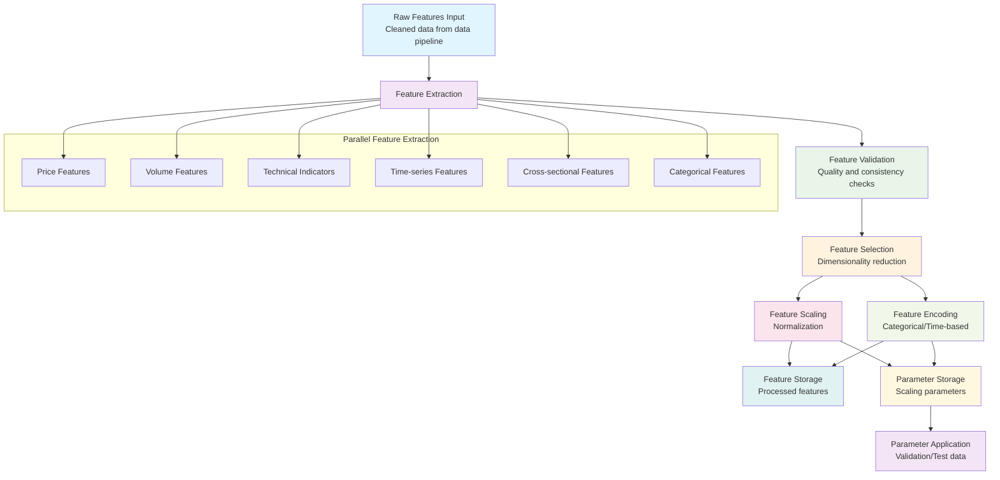
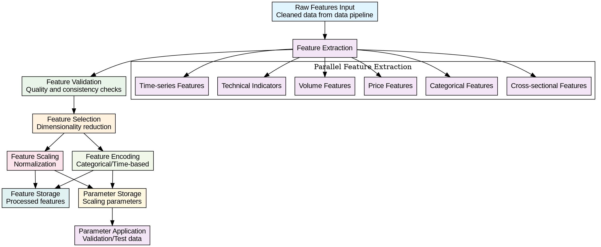

# DAG Representation for Feature Engineering Pipeline

## Overview

This document provides a Directed Acyclic Graph (DAG) representation of the feature engineering pipeline, showing the flow of data and dependencies between components.

## DAG Visualization

### Mermaid Diagram



### Graphviz Representation



## Node Descriptions

### A. Raw Features Input

- **Inputs**: Cleaned financial data from the data pipeline (Step 2)
- **Outputs**: Structured data ready for feature engineering
- **Technologies**: pandas DataFrames, numpy arrays
- **Responsibilities**:
  - Receive processed data from data cleaning stage
  - Validate data format and structure
  - Initialize feature engineering pipeline

### B. Feature Extraction

- **Inputs**: Raw features from data pipeline
- **Outputs**: Extracted features of different types
- **Processes**: Parallel extraction of multiple feature types
- **Parallel Branches**:
  - Price Features (returns, ratios, moving averages)
  - Volume Features (volume moving averages, ratios)
  - Technical Indicators (RSI, MACD, Bollinger Bands)
  - Time-series Features (lags, rolling statistics)
  - Cross-sectional Features (relative performance)
  - Categorical Features (sector encodings)

### C. Feature Validation

- **Inputs**: Extracted features from all branches
- **Outputs**: Validated features ready for selection
- **Processes**:
  - Quality checks (missing values, outliers)
  - Consistency validation (data types, ranges)
  - Integrity checks (temporal alignment)
  - Error handling and logging

### D. Feature Selection

- **Inputs**: Validated features
- **Outputs**: Reduced feature set
- **Processes**:
  - Statistical methods (variance thresholding)
  - Model-based methods (feature importance)
  - Time-series specific methods (correlation analysis)
  - Dimensionality reduction

### E. Feature Scaling

- **Inputs**: Selected numerical features
- **Outputs**: Scaled features
- **Processes**:
  - Min-Max scaling
  - Z-score standardization
  - Robust scaling
  - Rank transformation
  - Parameter isolation (training data only)

### F. Feature Encoding

- **Inputs**: Selected categorical and time-based features
- **Outputs**: Encoded features
- **Processes**:
  - One-hot encoding
  - Label encoding
  - Target encoding
  - Cyclical encoding for time features
  - Parameter isolation (training data only)

### G. Feature Storage

- **Inputs**: Scaled and encoded features
- **Outputs**: Stored processed features
- **Location**: `data/processed/features/`
- **Format**: Parquet for efficiency
- **Processes**:
  - Feature serialization
  - Metadata storage
  - Version control integration

### H. Parameter Storage

- **Inputs**: Scaling and encoding parameters
- **Outputs**: Stored parameters for consistent application
- **Location**: `data/processed/parameters/`
- **Format**: JSON/pickle for serialization
- **Processes**:
  - Parameter serialization
  - Version tracking
  - Access control for validation/test data

### I. Parameter Application

- **Inputs**: Stored parameters, validation/test data
- **Outputs**: Consistently transformed validation/test features
- **Processes**:
  - Apply training-derived parameters
  - Prevent data leakage
  - Ensure reproducibility

## Task Dependencies Analysis

### Critical Path

The critical path (longest sequence of dependent tasks) is:

```
Raw Features Input → Feature Extraction → Feature Validation →
Feature Selection → Feature Scaling → Feature Storage
```

### Parallelizable Tasks

After "Feature Extraction", the following tasks can be executed in parallel:

- Feature Validation (after all extraction branches complete)
- Individual feature extraction branches (Price, Volume, Technical Indicators, etc.)

### Task Levels

1. **Level 1**: Raw Features Input
2. **Level 2**: Feature Extraction (with parallel branches)
3. **Level 3**: Feature Validation
4. **Level 4**: Feature Selection
5. **Level 5**: (Parallel) Feature Scaling, Feature Encoding
6. **Level 6**: Feature Storage, Parameter Storage
7. **Level 7**: Parameter Application

## Resource Requirements

### Human Resources

- **Feature Engineers**: Levels 2-5 (implementation focus)
- **ML Engineers**: Levels 4-7 (algorithm focus)
- **QA Engineers**: Levels 3, 7 (testing focus)
- **DevOps Engineers**: Levels 6-7 (deployment focus)

### Technical Resources

- **Development Environment**: Required for all tasks
- **Version Control**: Required for Levels 1-7
- **Testing Framework**: Required for Levels 3, 7
- **Computing Resources**: High for Levels 2, 4 (feature computation)

## Timeline Estimation

### Task Duration Estimates

1. Raw Features Input: 15 minutes
2. Feature Extraction: 60 minutes
3. Feature Validation: 30 minutes
4. Feature Selection: 45 minutes
5. Feature Scaling: 30 minutes
6. Feature Encoding: 30 minutes
7. Feature Storage: 15 minutes
8. Parameter Storage: 15 minutes
9. Parameter Application: 15 minutes

### Critical Path Duration

Total: ~3 hours (sequential execution)

### Parallel Execution Duration

With parallelization of feature extraction: ~2.5 hours

## Risk Analysis

### High-Risk Dependencies

- **Feature Extraction** → All subsequent tasks depend on quality extraction
- **Feature Selection** → Affects model performance significantly
- **Parameter Storage** → Critical for preventing data leakage

### Mitigation Strategies

1. **Early Validation**: Implement comprehensive validation at each stage
2. **Incremental Commits**: Commit each component to version control
3. **Backup Points**: Create backups before major processing steps
4. **Monitoring**: Implement logging and monitoring throughout pipeline

## Monitoring and Control

### Progress Indicators

- **Completion Percentage**: Track completed pipeline stages
- **Feature Count**: Monitor number of features at each stage
- **Processing Time**: Track execution time for each component
- **Quality Metrics**: Monitor feature quality scores

### Milestone Checkpoints

1. **Milestone 1**: Directory structure and base classes implemented
2. **Milestone 2**: Feature extraction modules implemented
3. **Milestone 3**: Selection and transformation modules implemented
4. **Milestone 4**: Pipeline integration completed
5. **Milestone 5**: Testing and validation completed

## Rollback Points

### Safe Rollback States

1. **After Task 1**: Initial structure verified
2. **After Task 2**: Feature extraction implemented
3. **After Task 4**: Core pipeline implemented
4. **After Task 6**: Full pipeline implemented

### Recovery Procedures

Each rollback point has associated recovery procedures documented in `docs/features/step3_feature_engineering_detailed_plan.md`.

## Quality Gates

### Entry Criteria

- Previous task successfully completed
- Required artifacts produced
- Dependencies satisfied

### Exit Criteria

- Task deliverables completed
- Quality checks passed
- Documentation updated

### Approval Gates

- **Gate 1**: Architecture review after Task 2
- **Gate 2**: Design review after Task 4
- **Gate 3**: Implementation review after Task 6
- **Gate 4**: Final review before acceptance tests

## Communication Plan

### Status Reporting

- Daily progress updates
- Weekly milestone reports
- Immediate escalation for blockers

### Stakeholder Updates

- **Development Team**: Daily standups
- **Project Manager**: Weekly status reports
- **Quality Assurance**: Testing coordination
- **Documentation Team**: Review coordination

This DAG representation provides a comprehensive view of the feature engineering pipeline, its components, dependencies, and integration with the broader data processing workflow.
