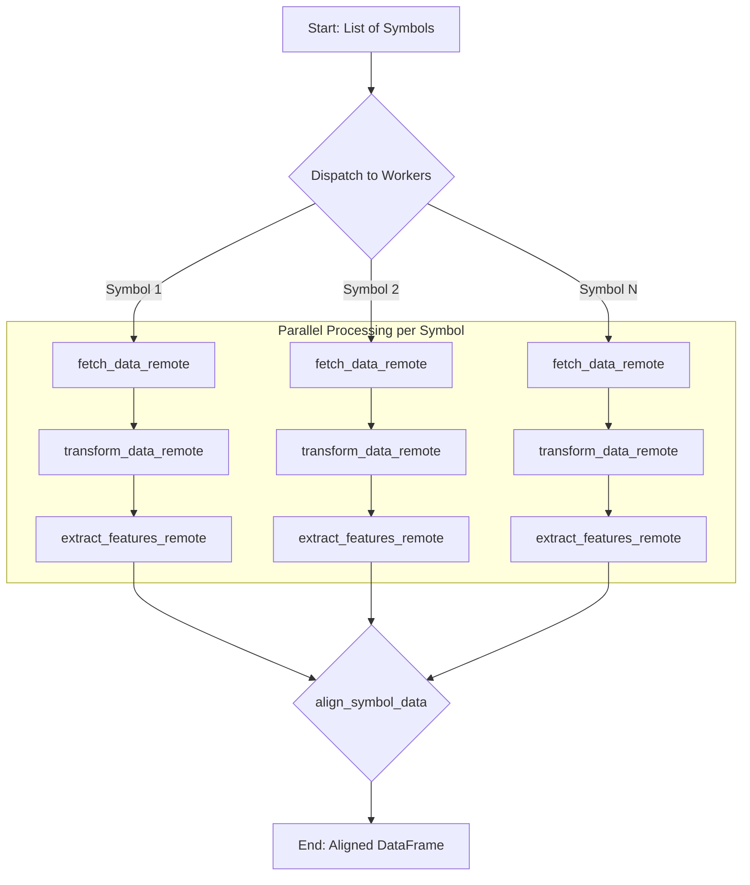

# Ray-Based Parallel Data-Processing Architecture

This document outlines a new, parallelized architecture for the data ingestion and processing pipeline, leveraging the Ray framework. The design addresses performance bottlenecks in the current sequential pipeline by adopting a symbol-centric, parallel execution model.

## 1. Proposed Architectural Changes

The current architecture processes a large, monolithic DataFrame through a series of sequential steps. This approach is inefficient and does not scale well as the number of symbols grows.

The new architecture refactors the pipeline to be **symbol-centric**. Instead of processing one large DataFrame, the pipeline will process data for each financial symbol in parallel. This significantly improves performance by distributing the workload across multiple CPU cores.

The core changes are:

- **Parallel Execution with Ray**: The `fetch_data`, `transform_yfinance_data`, and `extract_ts_features` functions will be converted into Ray remote functions (`@ray.remote`).
- **Symbol-Level Granularity**: Each remote function will operate on the data for a single symbol.
- **Centralized Data Alignment**: A new function, `align_symbol_data`, will be introduced to collect the results from the parallel tasks and structure them into a final, unified DataFrame suitable for downstream analysis and model training.

## 2. Architectural Diagram

The new parallel workflow is illustrated below. Each symbol is processed independently, with Ray managing the distributed execution.



## 3. Ray Integration and Code Snippets

To implement the parallel architecture, the key data processing functions will be decorated with `@ray.remote`.

### 3.1. Remote Data Fetching

The `fetch_data` function will be modified to fetch data for a single symbol.

**Proposed `ingestion.py` change:**

```python
import ray
import yfinance as yf
import pandas as pd

@ray.remote
def fetch_data_remote(
    symbol: str, start_date: str, end_date: str, interval: str = '1d'
) -> pd.DataFrame:
    """Fetches OHLCV data for a single symbol."""
    try:
        ticker = yf.Ticker(symbol)
        data = ticker.history(start=start_date, end=end_date, interval=interval)
        if not data.empty:
            data['Symbol'] = symbol
            return data.reset_index()
    except Exception as e:
        logger.error(f"Error fetching data for {symbol}: {e}")
        return pd.DataFrame()
```

### 3.2. Remote Data Transformation and Feature Extraction

Similarly, `transform_yfinance_data` and `extract_ts_features` will be adapted to operate on single-symbol DataFrames.

**Proposed `processing.py` changes:**

```python
import ray

@ray.remote
def transform_yfinance_data_remote(df: pd.DataFrame) -> pd.DataFrame:
    """Transforms a single-symbol DataFrame."""
    if df.empty:
        return pd.DataFrame()

    # Simplified transformation for a single symbol
    df.rename(columns={'Date': 'timestamp', 'Symbol': 'asset', 'Close': 'value'}, inplace=True)
    df['timestamp'] = pd.to_datetime(df['timestamp'])
    return df[['timestamp', 'asset', 'value']]


@ray.remote
def extract_ts_features_remote(df: pd.DataFrame) -> pd.DataFrame:
    """Extracts tsfresh features for a single symbol."""
    if df.empty:
        return pd.DataFrame()

    # tsfresh expects column_id, column_sort, column_value
    ts_features = extract_features(
        df,
        column_id='asset',
        column_sort='timestamp',
        column_value='value',
        impute_function=impute,
        show_warnings=False
    )
    return ts_features
```

### 3.3. Orchestration

The new orchestrator will launch these remote tasks and collect their results.

```python
import ray

def new_orchestrator(symbols: list[str], start: str, end: str):
    ray.init(ignore_reinit_error=True)

    # 1. Fetch data in parallel
    fetch_futures = [
        fetch_data_remote.remote(s, start, end) for s in symbols
    ]

    # 2. Transform data in parallel as it becomes available
    transform_futures = [
        transform_yfinance_data_remote.remote(fetch_future)
        for fetch_future in fetch_futures
    ]

    # 3. Extract features in parallel
    feature_futures = [
        extract_ts_features_remote.remote(transform_future)
        for transform_future in transform_futures
    ]

    # 4. Collect and align results
    results_dict = {}
    for i, symbol in enumerate(symbols):
        results_dict[symbol] = ray.get(feature_futures[i])

    aligned_data = align_symbol_data(results_dict)

    ray.shutdown()
    return aligned_data
```

## 4. Symbol Alignment Strategy

After parallel processing, the results will be a dictionary mapping each symbol to its feature DataFrame. The `align_symbol_data` function will be responsible for merging these into a single, cohesive DataFrame.

This function will be placed in a new module, such as `src/data/alignment.py`.

**Proposed `align_symbol_data` function:**

```python
import pandas as pd
from typing import Dict

def align_symbol_data(
    symbol_features: Dict[str, pd.DataFrame]
) -> pd.DataFrame:
    """
    Aligns and merges feature DataFrames from multiple symbols.

    Args:
        symbol_features: A dictionary where keys are symbol names and
                         values are their corresponding feature DataFrames.

    Returns:
        A single DataFrame with all features aligned.
    """
    all_features = []
    for symbol, features in symbol_features.items():
        if not features.empty:
            # Add a 'symbol' column to identify the data source
            features['symbol'] = symbol
            all_features.append(features)

    if not all_features:
        return pd.DataFrame()

    # Concatenate all features into a single DataFrame
    final_df = pd.concat(all_features, ignore_index=True)

    # Ensure a consistent column order
    cols = ['symbol'] + [col for col in final_df.columns if col != 'symbol']
    final_df = final_df[cols]

    return final_df
```
