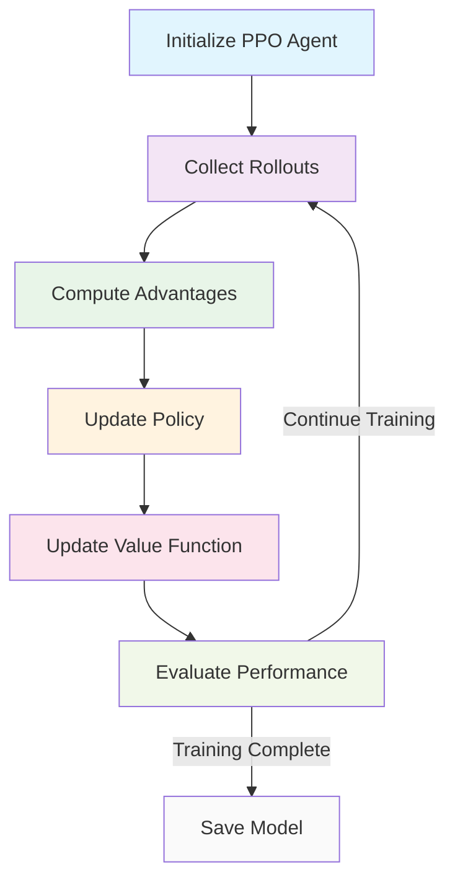
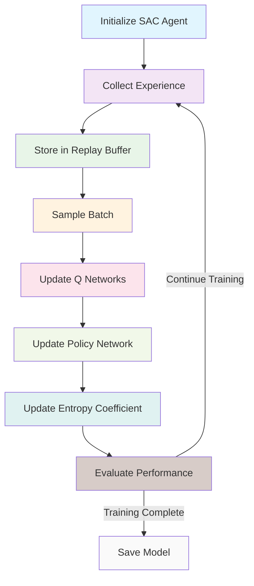

# Reinforcement Learning Components

The Reinforcement Learning components implement two state-of-the-art RL algorithms: PPO (Proximal Policy Optimization) using Stable-Baselines3 and SAC (Soft Actor-Critic) using Ray RLlib. These components are designed for training trading agents that can make optimal portfolio allocation decisions.

## Overview

The RL components handle:

1. Implementation of PPO and SAC algorithms for trading
2. Integration with custom feature extractors (CNN+LSTM)
3. Training pipeline management
4. Model evaluation and comparison
5. Hyperparameter optimization
6. Checkpointing and model persistence

## PPO (Proximal Policy Optimization)

### Algorithm Overview

PPO is a policy gradient method that uses a clipped objective function to prevent large policy updates. It's known for its stability and ease of implementation.

### Key Features

- Clipped surrogate objective
- Adaptive KL penalty (optional)
- Multiple epochs per update
- Advantage estimation with GAE

### Architecture Integration

The PPO implementation integrates with the CNN+LSTM model architecture:

1. **CNNLSTMFeaturesExtractor**: Wraps the CNN+LSTM model to make it compatible with Stable-Baselines3's feature extractor interface
2. **CNNLSTMPolicy**: Custom policy that uses the CNN+LSTM feature extractor with separate policy and value networks
3. **PPOAgent**: High-level interface for creating and using a PPO agent with the CNN+LSTM feature extractor

### Training Pipeline



## SAC (Soft Actor-Critic)

### Algorithm Overview

SAC is an off-policy actor-critic algorithm that maximizes both expected reward and entropy. It's known for sample efficiency and stability.

### Key Features

- Maximum entropy framework
- Off-policy learning with replay buffer
- Soft Q-learning updates
- Automatic entropy tuning

### Architecture Integration

The SAC implementation integrates with the CNN+LSTM model architecture:

1. **CNNLSTMFeatureExtractor**: Wraps the CNN+LSTM model to make it compatible with Ray RLlib's model system
2. **CNNLSTMSACModel**: Custom SAC model that uses the CNN+LSTM feature extractor with separate policy and Q-networks
3. **SACAgent**: High-level interface for creating and using a SAC agent with the CNN+LSTM feature extractor

### Training Pipeline



## CNN+LSTM Feature Extractor

### Architecture

The CNN+LSTM model processes multi-asset financial time series data through:

1. **CNN layers**: For spatial feature extraction from cross-sectional market data
2. **LSTM layers**: For temporal sequence modeling across time steps
3. **Dense layers**: For producing final output features

### Configuration Parameters

- `time_steps`: Number of time steps in the input sequence (default: 30)
- `assets`: Number of assets in the input (default: 100)
- `features`: Number of features per asset (default: 15)
- `cnn_filters`: Number of filters for each CNN layer (default: [64, 32, 16])
- `lstm_units`: Number of units for each LSTM layer (default: [128, 64])
- `dropout_rate`: Dropout rate for regularization (default: 0.2)
- `output_dim`: Dimension of the output features (default: 64)

## Training Management

### Hyperparameter Optimization

- Bayesian optimization with Optuna
- Grid search for key parameters
- Population-based training
- Learning rate scheduling

### Distributed Training

- Ray Tune integration for hyperparameter tuning
- Parallel training across multiple environments
- Resource allocation and scheduling
- Fault tolerance and checkpointing

### Model Evaluation

- In-sample performance metrics
- Out-of-sample backtesting
- Comparison with benchmark strategies
- Risk-adjusted return analysis

## Module Structure

```
src/rl/
├── __init__.py
├── ppo/
│   ├── __init__.py
│   ├── ppo_agent.py
│   ├── ppo_policy.py
│   └── ppo_features.py
├── sac/
│   ├── __init__.py
│   ├── sac_agent.py
│   ├── sac_model.py
│   └── sac_features.py
├── training/
│   ├── __init__.py
│   ├── trainer.py
│   ├── callbacks.py
│   └── evaluation.py
├── hyperparameter/
│   ├── __init__.py
│   ├── optimization.py
│   └── search_spaces.py
└── utils/
    ├── __init__.py
    ├── checkpointing.py
    ├── monitoring.py
    └── visualization.py
```

## Interfaces

### PPO Agent Interface

```python
class PPOAgent:
    def __init__(self, env, **kwargs):
        """Initialize PPO agent with environment and parameters"""
        pass

    def learn(self, total_timesteps):
        """Train the agent for specified timesteps"""
        pass

    def predict(self, observation):
        """Get action prediction from the agent"""
        pass

    def save(self, path):
        """Save the agent to specified path"""
        pass

    def load(self, path):
        """Load the agent from specified path"""
        pass
```

### SAC Agent Interface

```python
class SACAgent:
    def __init__(self, env, **kwargs):
        """Initialize SAC agent with environment and parameters"""
        pass

    def train(self, num_iterations):
        """Train the agent for specified iterations"""
        pass

    def compute_action(self, observation):
        """Compute action from the agent"""
        pass

    def save(self, path):
        """Save the agent to specified path"""
        pass

    def restore(self, path):
        """Restore the agent from specified path"""
        pass
```

## Configuration

The RL components can be configured through configuration files:

```yaml
rl:
  ppo:
    algorithm: "PPO"
    learning_rate: 3e-4
    n_steps: 2048
    batch_size: 64
    n_epochs: 10
    gamma: 0.99
    gae_lambda: 0.95
    clip_range: 0.2
    ent_coef: 0.0
    vf_coef: 0.5
    max_grad_norm: 0.5

  sac:
    algorithm: "SAC"
    learning_rate: 3e-4
    buffer_size: 1000000
    batch_size: 256
    train_batch_size: 256
    gamma: 0.99
    tau: 0.005
    target_entropy: "auto"
    n_step: 1

  cnn_lstm:
    time_steps: 30
    assets: 100
    features: 15
    cnn_filters: [64, 32, 16]
    lstm_units: [128, 64]
    dropout_rate: 0.2
    output_dim: 64

  training:
    total_timesteps: 1000000
    eval_freq: 10000
    checkpoint_freq: 50000
```

## Performance Monitoring

### Training Metrics

- Episode rewards
- Policy loss
- Value function loss
- Entropy measures
- Gradient norms

### Evaluation Metrics

- Sharpe ratio
- Maximum drawdown
- Win rate
- Profit factor
- Calmar ratio

## Performance Considerations

- GPU acceleration for neural network training
- Efficient memory usage for replay buffers
- Parallel environment execution
- Checkpointing for fault tolerance
- Distributed training with Ray
