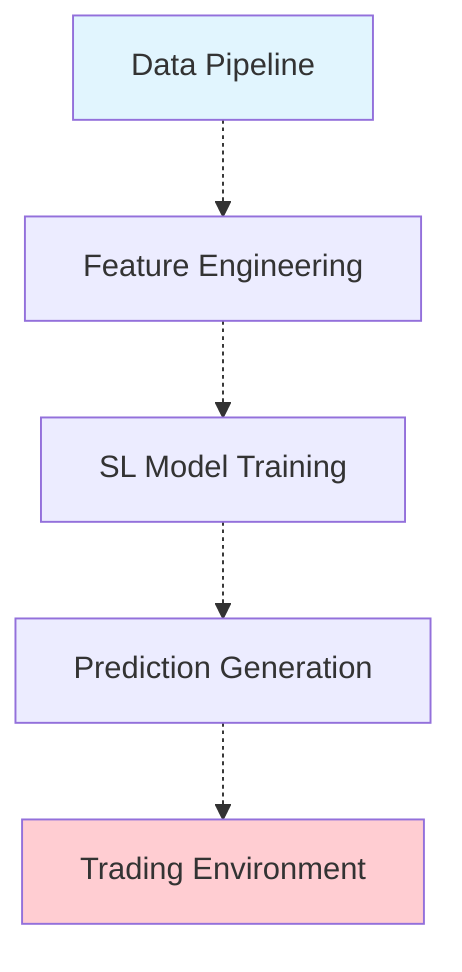

# Trading Environment & Model Setup Assessment

## Critical Assessment: Integration Gaps Identified

After analyzing our trading environment and model setups against our new unified implementations, **several critical integration gaps require overhaul** to fully leverage our new data engine and experimentation framework.

## 🚨 **MAJOR INTEGRATION ISSUES DISCOVERED**

### 1. **Data Format Mismatch (Critical)**

**Current State:**

- Trading environment expects: `mu_hat`, `sigma_hat` (SL predictions) + engineered features
- Data pipeline outputs: Raw OHLCV data (`Open`, `High`, `Low`, `Close`, `Volume`, etc.)

**Problem:**

```python
# TradingEnvironment expects (src/envs/trading_env.py:115):
target_cols = ['mu_hat', 'sigma_hat']
self.targets = df[target_cols].values  # ❌ FAILS - columns don't exist

# Data pipeline outputs:
['Open', 'High', 'Low', 'Close', 'Volume', 'Dividends', 'Stock Splits', 'symbol']
```

**Impact:** Trading environment cannot consume data pipeline outputs directly.

### 2. **Feature Engineering Disconnect (Critical)**

**Current State:**

- Data pipeline: Basic feature creation (SMA, RSI, etc.) but no SL predictions
- Trading environment: Requires 514-dimensional observation space with SL predictions
- Missing: End-to-end feature engineering → SL training → prediction pipeline

**Problem:**

- No integration between data pipeline and supervised learning models
- Missing feature engineering that matches trading environment expectations
- No workflow to generate `mu_hat`/`sigma_hat` predictions

### 3. **Workflow Integration Gaps (High Priority)**

**Current State:**

- Data engine: Standalone pipeline for data processing
- Experiment framework: Standalone pipeline for model training
- Trading environment: Expects pre-processed features + predictions

**Missing Integration:**



## 📋 **REQUIRED OVERHAULS**

### 1. **Enhanced Data Pipeline Integration**

**Status:** 🔄 **Requires Significant Extension**

**Required Changes:**

```python
# src/data/orchestrator.py - Add SL integration stage
def _run_sl_prediction_stage(self, cleaned_data):
    """Generate SL predictions (mu_hat, sigma_hat) from cleaned data."""
    # Load trained SL models
    # Generate predictions
    # Add predictions to dataset
    pass

# Enhanced pipeline flow:
# Data Ingestion → Cleaning → Feature Engineering → SL Predictions → Storage
```

**Implementation Needs:**

- [ ] SL model integration in data orchestrator
- [ ] Prediction generation pipeline
- [ ] Feature engineering alignment with trading environment
- [ ] Output format standardization

### 2. **Trading Environment Modernization**

**Status:** ⚠️ **Needs Major Updates**

**Required Changes:**

```python
# src/envs/trading_env.py - Enhanced data loading
def _load_data(self, data_file: str):
    """Load data with support for multiple formats."""
    if data_file.endswith('.parquet'):
        # Handle unified data pipeline outputs
        # Check for required columns
        # Generate missing predictions if needed
    else:
        # Legacy format handling
```

**Implementation Needs:**

- [ ] Multi-format data loading (pipeline outputs vs legacy features)
- [ ] Dynamic prediction generation fallback
- [ ] Observation space adaptation
- [ ] Backward compatibility maintenance

### 3. **Unified Workflow Architecture**

**Status:** 🚧 **Requires New Architecture**

**Required Implementation:**

```python
# New: src/workflows/unified_pipeline.py
class UnifiedTradingWorkflow:
    """End-to-end workflow: Data → Features → SL → RL → Trading."""

    def __init__(self, config: UnifiedWorkflowConfig):
        self.data_engine = DataOrchestrator(config.data_config)
        self.experiment_engine = TrainingOrchestrator(config.experiment_config)
        self.trading_env = TradingEnvironment(config.env_config)

    def run_complete_pipeline(self):
        # 1. Data pipeline
        # 2. Feature engineering
        # 3. SL model training
        # 4. Prediction generation
        # 5. RL training
        # 6. Ensemble creation
        # 7. Backtesting
```

### 4. **Model Factory Integration**

**Status:** ✅ **Mostly Ready** (Minor updates needed)

**Current Strengths:**

- Comprehensive model factory (`src/sl/models/factory.py`)
- Multiple model types supported
- Ensemble capabilities

**Required Updates:**

- [ ] Integration with data pipeline outputs
- [ ] Prediction pipeline standardization
- [ ] Feature alignment verification

## 🎯 **INTEGRATION READINESS ASSESSMENT**

| Component                | Current Status | Integration Ready        | Required Work             |
| ------------------------ | -------------- | ------------------------ | ------------------------- |
| **Data Engine**          | ✅ Complete    | 🔄 Partial               | SL prediction integration |
| **Experiment Framework** | ✅ Complete    | ✅ Ready                 | Minor path fixes          |
| **SL Models**            | ✅ Complete    | ✅ Ready                 | Output format alignment   |
| **RL Agents**            | ✅ Complete    | ⚠️ Environment dependent | Trading env updates       |
| **Trading Environment**  | ✅ Functional  | ❌ Not compatible        | Major data format updates |
| **Ensemble System**      | ✅ Complete    | ⚠️ Environment dependent | Trading env updates       |

## 🛠️ **RECOMMENDED OVERHAUL STRATEGY**

### Phase 1: **Data-Trading Integration** (High Priority)

1. **Extend data pipeline** to generate SL predictions
2. **Update trading environment** to handle multiple data formats
3. **Create unified data format** specification

### Phase 2: **Workflow Unification** (Medium Priority)

1. **Create unified workflow orchestrator**
2. **Integrate experiment and data frameworks**
3. **Add end-to-end configuration management**

### Phase 3: **Advanced Features** (Lower Priority)

1. **Real-time prediction updates**
2. **Dynamic model retraining**
3. **Production deployment pipeline**

## 💡 **ALTERNATIVE APPROACH: Bridge Components**

Instead of major overhauls, we could create **bridge components**:

```python
# src/integrations/data_trading_bridge.py
class DataTradingBridge:
    """Converts data pipeline outputs to trading environment format."""

    def convert_pipeline_output(self, pipeline_data: pd.DataFrame) -> pd.DataFrame:
        # Add feature engineering
        # Generate SL predictions using pre-trained models
        # Format for trading environment
        pass

# src/integrations/workflow_bridge.py
class WorkflowBridge:
    """Orchestrates data pipeline → experiment framework → trading."""
    pass
```

## 🔗 **CONCLUSION**

**Assessment Result:** The trading environment and model setups require **significant integration work** to fully leverage our new unified implementations.

**Key Issues:**

1. **Data format incompatibility** between pipeline outputs and trading environment
2. **Missing SL prediction integration** in data pipeline
3. **Workflow fragmentation** between frameworks

**Recommendations:**

1. **Short-term:** Create bridge components for immediate integration
2. **Long-term:** Implement unified workflow architecture for seamless operation

The individual components (data engine, experiments, models) are robust, but **integration architecture** needs development to create a cohesive end-to-end system.
