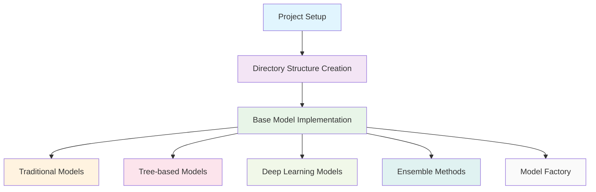
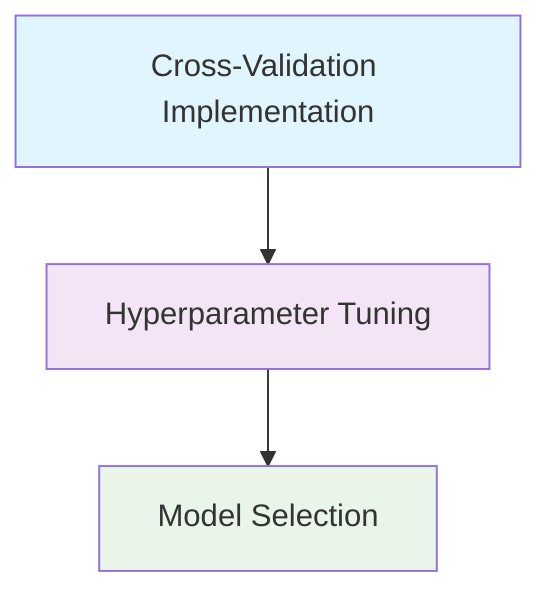
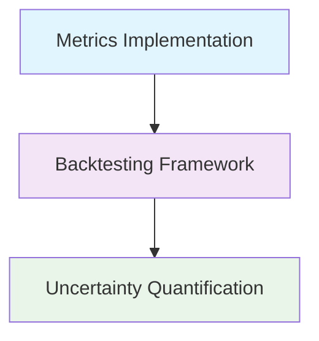
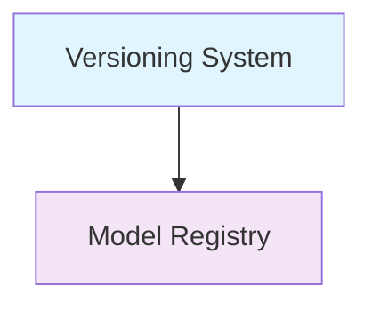
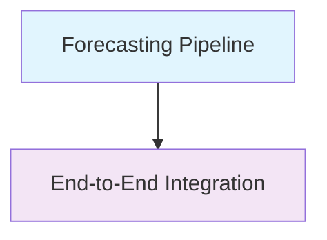
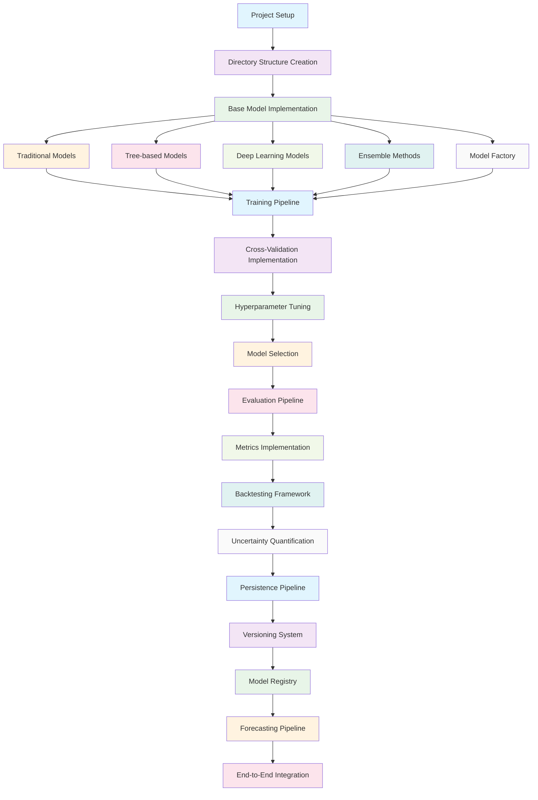
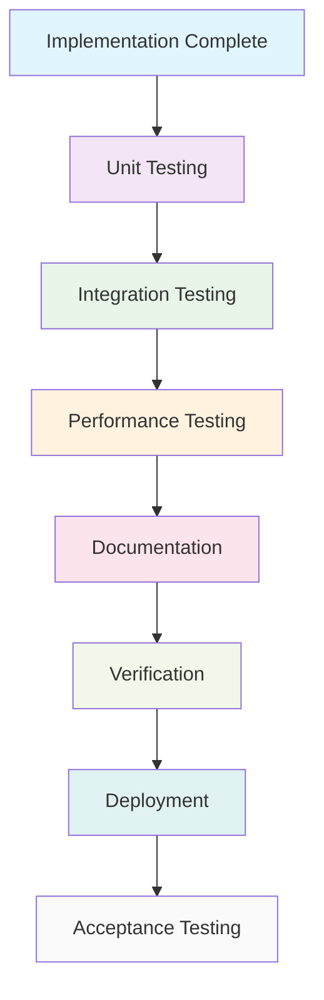
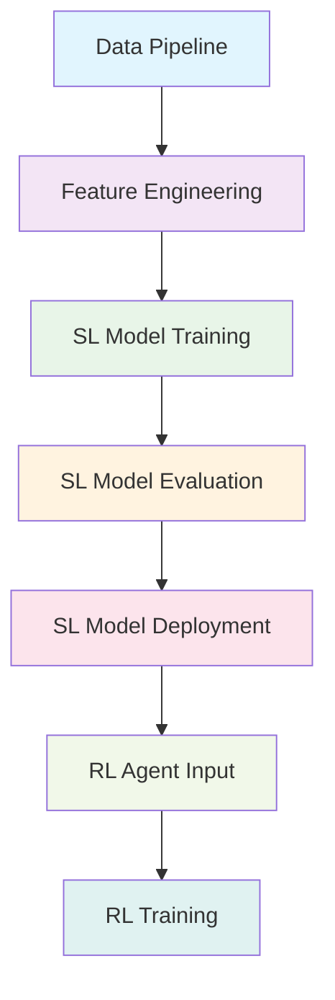

# SL Model Implementation - DAG Representation

## 1. SL Model Pipeline Nodes

### 1.1 Core Implementation Nodes



### 1.2 Training Pipeline Nodes



### 1.3 Evaluation Pipeline Nodes



### 1.4 Persistence Pipeline Nodes



### 1.5 Pipeline Integration Nodes



## 2. Complete SL Model Implementation DAG



## 3. Testing and Deployment DAG



## 4. Dependencies

### 4.1 Implementation Dependencies

```
[Project Setup] → [Directory Structure Creation] → [Base Model Implementation] →
[Traditional Models, Tree-based Models, Deep Learning Models, Ensemble Methods, Model Factory] →
[Training Pipeline] → [Cross-Validation Implementation] → [Hyperparameter Tuning] → [Model Selection] →
[Evaluation Pipeline] → [Metrics Implementation] → [Backtesting Framework] → [Uncertainty Quantification] →
[Persistence Pipeline] → [Versioning System] → [Model Registry] →
[Forecasting Pipeline] → [End-to-End Integration]
```

### 4.2 Testing Dependencies

```
[Implementation Complete] → [Unit Testing] → [Integration Testing] →
[Performance Testing] → [Documentation] → [Verification] → [Deployment] → [Acceptance Testing]
```

### 4.3 Integration with Overall System


